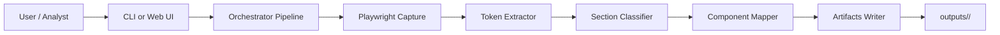
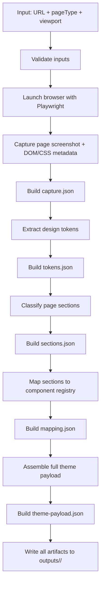
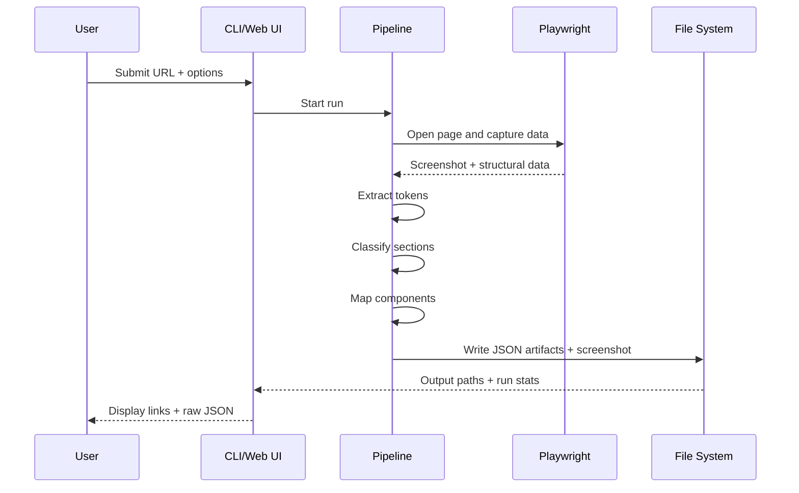
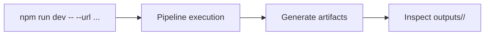
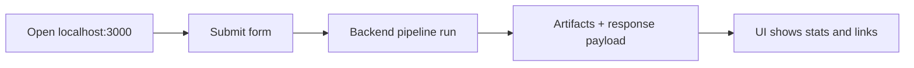
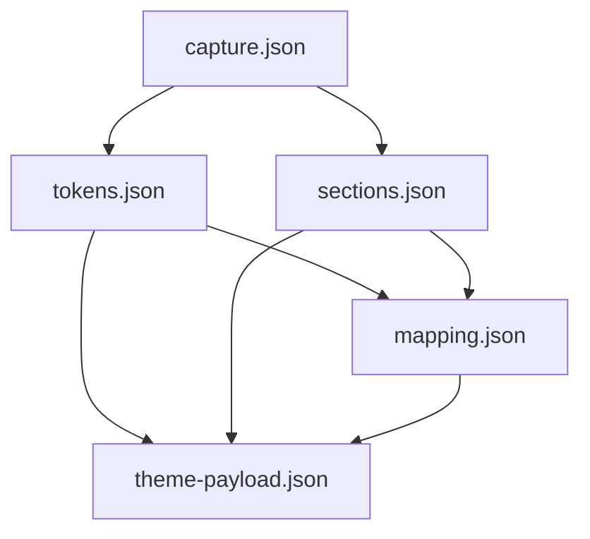

# AI-Based Design Replication Engine (MVP)

This project is a Node.js/TypeScript MVP that:

1. Takes a storefront URL.
2. Captures visual + structural page data via Playwright.
3. Extracts design tokens (colors, typography, spacing, radius).
4. Detects page sections (hero, product grid, header, footer, etc.).
5. Maps detected sections into an internal component registry.

## Full Project Workflow

### 1) High-Level Architecture



### 2) End-to-End Processing Flow



### 3) Runtime Sequence (Web/CLI to Artifacts)



## Run

```bash
npm install
npm run dev -- --url https://example-store.com --pageType home --viewport desktop
```

Arguments:
- `--url` (required): storefront URL
- `--pageType` (optional): `home` | `collection` | `product`
- `--viewport` (optional): `desktop` | `mobile`

Workflow for CLI mode:



## Web UI

Run the local web interface:

```bash
npm run web
```

Then open `http://localhost:3000`.

Use the form to submit a URL. The server runs the pipeline and returns:
- run stats
- links to generated artifacts
- raw JSON response

Workflow for Web UI mode:



## Output

Each run creates a folder under `outputs/<timestamp>/` with:

- `capture.json`: raw capture bundle
- `tokens.json`: extracted design tokens
- `sections.json`: section classification output
- `mapping.json`: mapping-only output
- `theme-payload.json`: full payload ready for import/review
- Screenshot file used as visual reference

Artifact dependency chart:



## Notes

- This MVP is deterministic and rule-based for extraction/classification.
- AI can later be layered in for ambiguous section classification and smarter mapping decisions.
